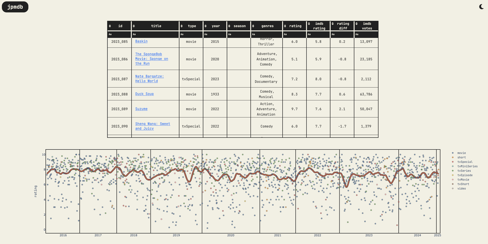

# [jpmdb](https://jpmdb.jeffbrennan.dev/)

a personalized movie database for my friend Juan

## Cleaning Process

1. The original source data was a .txt file containing a list of movies/tv shows, the order they were watched that year, and a rating out of 10

2. The .txt file was parsed in `create_silver_jpmdb.py`, including parsing the ratings, seasons, watch order, year specifiers and other metadata

3. Downloaded imdb data from [IMDb Datasets](https://datasets.imdbws.com/) and converted the .gz files into `silver/imdb/title_basics` and `silver/imdb/title_ratings` using `create_silver_imdb.py`

4. The jpmdb and imdb datasets were initially joined using standard string cleaning and fuzzy matching approaches into `stg_jpmdb_combined` using `create_silver_stg_jpmdb_combined.py`

5. Entries were manually reviewed a small CLI tool `review_combined_jpmdb.py`, giving an opportunity to correct fuzzy matching errors and manually add missing entries

6. After all entries were validated, the data was moved to the gold table `gold/jpmdb` in `create_gold_jpmdb.py`

## Dashboard

The dashboard is built using Dash and Plotly. It currently includes 4 visualizations:

1. A virtualized table of all entries in the database
2. A scatter plot of ratings over the watched order to show ratings over time
3. A scatter plot comparing ratings to IMDb ratings
4. A box plot showing distribution of ratings per IMDb genre

## TODOs

- [] incorporate scraped poster images into the dashboard
- [] cross visualization filtering by genre
- [] short summary of top 10 titles per year